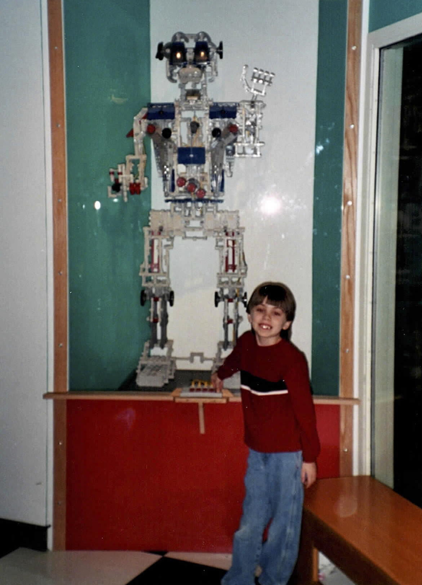

# About

*(Yes, I've been into tech for a while.)*

I’m a data-driven technical communicator who sees writing as a form of technology—and technology as applied philosophy. That perspective has carried me from the museum floor, where I first posed next to a Lego robot, to the frontlines of AI development, where I now train large language models at Innodata. My background blends technical communication, creative writing, and literary criticism, allowing me to approach emerging technologies with both critical insight and creative range.

Before working in industry, I spent over five years teaching writing in higher education, where I developed and led units on AI ethics and data storytelling in the Manning College of Information and Computer Sciences. As a teacher trainer, I also created a toolkit for teaching writing in the age of ChatGPT, helping instructors adapt pedagogy to generative technologies. This work culminated in presentations and publications on AI and writing, including for the ACM Computers and Society newsletter and the 2024 AI in the Liberal Arts conference at Amherst College.

My portfolio includes educational materials, job aids, usability reports, and documentation created for audiences ranging from AI developers and data annotators to computer science majors and municipal stakeholders. I specialize in creating accessible, user-focused content that bridges technical precision with strategic communication. My workflow often combines structured writing with multimedia and systems thinking to support knowledge transfer across disciplines.

Whether designing for a town’s waste stream or a person’s mental workspace, I aim to make complex systems more legible, humane, and sustainable. My work is grounded in care—for users, for ecosystems, and for the technologies that shape how we live and learn.
