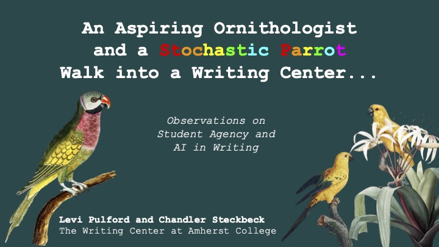
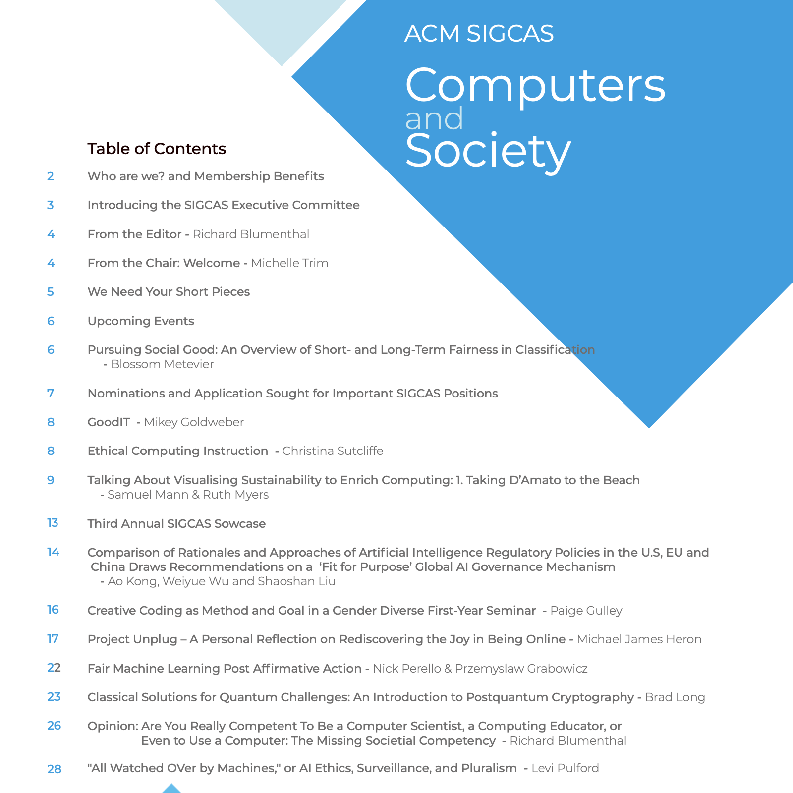
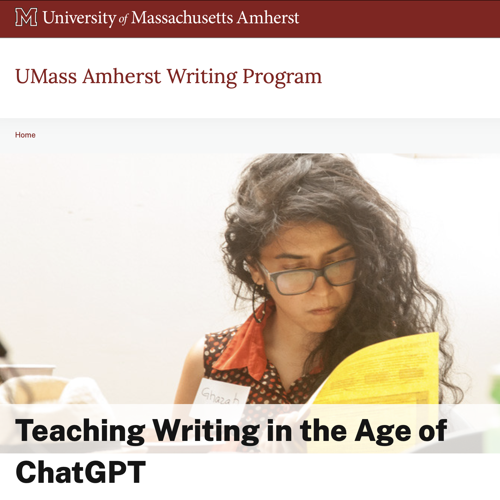
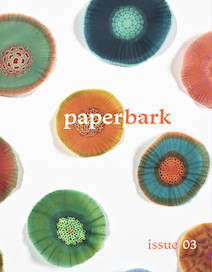

# Portfolio

Below you will find samples of my work. All views expressed are my own. Click on linked titles to view or download the full sample.

---
## <a href="https://aokoye.github.io/ptw330-usabilityreport/" target="_blank" rel="noopener noreferrer">Note-Taking App Usability Report: Notion & Obsidian</a>

  <iframe
    style="width: 100%; height: 335px; border: none;"
    src="https://embed.figma.com/deck/Lnusk1eynpjrWycjsJvEIX/UI-Breakdowns?node-id=2001-47&scaling=scale-down&content-scaling=fixed&page-id=0%3A1&embed-host=share"
    allowfullscreen>
  </iframe>

*Interactive UI breakdowns inspired by <a href="https://www.useronboard.com/user-onboarding-teardowns/" target="_blank" rel="noopener noreferrer">Samuel Hulick's UX Teardowns</a>*

**Roles:** UX Researcher · Content Strategist · Chief Calm Technology Evangelist · Multimedia Specialist

**Description:** As part of the capstone project for the University of Washington’s Certificate in Professional Technical Writing, I collaborated on a comparative usability study of two popular note-taking applications, Notion and Obsidian. Our team of five UX researchers evaluated onboarding workflows, user satisfaction, and interface design, grounding recommendations in data analysis. I contributed across UX, content, and visual strategy roles by conducting secondary research drawing from Nielsen Norman Group to inform content strategy; developing user and product manager personas to align usability with business impact; translating research insights into actionable recommendations; and producing interactive UI breakdowns, attention graphs, and visual workflows to clarify user journeys and interface demands.

I served as the chief technology evangelist of Calm Technology principles from Amber Case to advocate for low-friction, ambient user experiences. Simultaneously informed by Alexandra Mack’s *Talking to Stakeholders*, I practiced risk framing and strategic listening to ensure recommendations aligned with organizational priorities as well as user needs.

**Tools:** Figma, Canva, Google Drive, Google Forms, Apple Screen Recording

**Highlights:**
* Developed an attention-based UI framework to diagnose usability pain points
* Applied user- and stakeholder-aligned design principles to support long-term value creation
* Combined ambient design theory with practical UX research methods for product insight

---
## Environmental Sustainability Documentation for Local Governments

  
  
  

**Roles:** Writer · Editor · Production Specialist

**Description:** As part of a collaborative project in the University of Washington technical writing certificate program, I worked with two fellow cohort members to develop instructional, persuasive, and informative materials on environmental technology and sustainability. Our work supported local government initiatives in Norfolk, VA; Redlands, CA; and Morrisville, NC, with a focus on improving public engagement and accessibility of information. Each document was designed for clarity, usability, and effectiveness in addressing community needs.
* **Recycling Aid for Norfolk, VA (Production Specialist):** An infographic helping residents properly sort recyclables to reduce contamination and improve waste management efficiency.
* **Solar Panel Installation Proposal for Redlands, CA (Editor):** A formal proposal advocating for municipal solar energy adoption, including cost-benefit analysis, funding opportunities, and environmental impact assessments.
* **Indoor Air Quality Fact Sheets for Morrisville, NC (Writer):** A set of concise fact sheets detailing pollutant sources, air quality monitoring metrics, health risks, and mitigation techniques for residential and public spaces.

**Tools:** Microsoft Word, Adobe InDesign

**Highlights:**
* Co-authored a series of technical documents tailored to public audiences and local government stakeholders.
* Designed clear, structured content with visual aids to enhance comprehension and usability.
* Applied technical writing best practices to support environmental sustainability efforts.

---
## Player's Manual to Generative AI Standards

Please contact me for access.

**Role:** Author 

**Description:** As a personal project, I created a 29-page concept of operations, or ConOps, featuring resources for navigating technical standards in generative AI. It applies governance frameworks to widely taught concepts in computer science and machine learning, such as tokens and transformers. By framing the contents as a player's manual, this document leverages prior knowledge of games to facilitate knowledge transfer about AI. It also remains politically neutral, in that it does not call for or critique either regulatory or deregulatory approaches. Instead, it emphasizes the voluntary nature of standards. Additionally, this ConOps applies two forms of reasoning—reasoning with first principles and reasoning with analogy—to help AI professionals create ethical mental models of their work.

**Tools:** Microsoft Word, Google Slides, Adobe InDesign

**Highlights:**
* Authored a detailed guide that synthesizes complex concepts into accessible and actionable content.
* Developed visual aids and workflows to illustrate technical processes and enhance usability.
* Addressed emerging industry needs by outlining best practices for ethical and practical AI development.

---
## <a href="https://raw.githubusercontent.com/LeviPulford/portfolio/df5e4355b89330944d8b549d43eb6c7feeb902b6/PDF%20Downloads/AILA%20Workshop%20Slides.pdf" download>Workshop on Writing with AI</a>

Read about <a href="https://www.liberal-arts.ai/2024-undergraduate-conference/" target="_blank" rel="noopener noreferrer">the 2024 AILA conference</a>.

**Role:** Writing Center Associate  

**Description:** At Amherst College, I co-facilitated a staff-led workshop titled "An Aspiring Ornithologist and a Stochastic Parrot Walk into a Writing Center" during the 2024 AI in the Liberal Arts (AILA) undergraduate research conference. This workshop offered observations on student agency and AI in writing before inviting participants to explore the impact of artificial intelligence on writing. Activities included creating imaginative documents and data visualizations to identify opportunities and challenges when integrating AI into the writing process. The workshop also highlighted interdisciplinary insights into how AI reshapes writing pedagogies, practices, and the evolving relationship between humans and technology.  

**Tools:** Google Slides, ChatGPT, Poll Everywhere  

**Highlights:**  
* Designed and facilitated interactive activities that encouraged critical and creative thinking about AI in writing.  
* Engaged an interdisciplinary audience in discussions that bridged liberal arts, pedagogy, and artificial intelligence.  
* Co-created imaginative resources with participants, including data visualizations and collaborative documents, to capture key workshop insights.

---

## <a href="https://raw.githubusercontent.com/LeviPulford/portfolio/e786dec709fa7b1fa50092664624f2a00cb454f6/PDF%20Downloads/Levi's%20Op-Ed.pdf" download>Op-Ed for *Computers and Society*</a>  
 

Read <a href="https://www.sigcas.org/2023/11/15/computers-and-society-volume-52-number-2-november-2023-issue-now-available/" target="_blank" rel="noopener noreferrer">the full issue</a>.

**Role:** Contributor 

**Description:** I was invited by the chair of the ACM special interest group Computers and Society (SIGGCAS) to contribute a "quick-take" op-ed for the September 2023 newsletter. My piece, titled "'All Watched Over By Machines': AI Ethics, Surveillance, and Pluralism," explores the social and ethical consequences of AI and surveillance technologies, advocating for pluralistic approaches to technological governance. This work reflects SIGCAS's mission to raise awareness about the societal impact of technology.  

**Tools:** Microsoft Word  

**Highlights:**  
* Solicited to write an op-ed for a respected ACM publication, demonstrating recognition of my expertise in AI ethics and communication.  
* Engaged an interdisciplinary audience of computer scientists, ethicists, and policymakers with accessible yet nuanced discussion.  
* Addressed critical ethical challenges at the intersection of AI, surveillance, and societal diversity, aligning with SIGCAS's mission.

---

## <a href="https://www.umass.edu/writing-program/chatgpt" target="_blank" rel="noopener noreferrer">Toolkit for Teaching Writing in the Age of ChatGPT</a> 

**Role:** Graduate Assistant Director for Teacher Training  

**Description:** For the UMass Amherst Writing Program, I co-developed the "Teaching Writing in the Age of ChatGPT" webpage for instructors during the 2022-2023 academic year. This resource equips educators with theoretically informed strategies to adapt to the challenges and opportunities posed by AI in writing pedagogy. My primary contribution was the section on Scholarly Roots for Writing Studies' Best Practices, which highlights foundational research in process pedagogy, critical self-reflection, and writing-to-learn strategies. Much of this research was work I had accumulated over 15 credits of graduate-level courses in composition and rhetoric. The webpage continues to serve instructors across first-year writing, junior-year writing, and writing-across-the-disciplines courses.  

**Tools:** Google Docs  

**Highlights:**  
* Strategized content for the "Scholarly Roots" section, grounding contemporary teaching practices in foundational research.  
* Contributed to a resource that aligns theoretical frameworks with practical strategies for writing instruction in the context of AI.  
* Collaborated with educators and administrators to curate content that addresses diverse teaching needs, resulting in a widely shared resource within the university community.

---

## <a href="https://raw.githubusercontent.com/LeviPulford/portfolio/76cd443821e4ff1f7da2349d50ca79ab2bc9779b/PDF%20Downloads/Paperbark%20Issue03-compressed.pdf" download>Issue 03 of Paperbark Magazine</a> 

View <a href="https://scholarworks.umass.edu/entities/publication/ccfd8431-c1bf-4636-b18e-3234c135ccc0" target="_blank" rel="noopener noreferrer">a high-resolution copy</a>.

**Role:** Editorial Assistant · Social Media Lead  

**Description:** <a href="https://www.paperbarkmag.org" target="_blank" rel="noopener noreferrer">Paperbark Magazine</a> bridges science, culture, and sustainability, promoting interdisciplinary thinking and intergenerational collaboration to address critical environmental and societal issues. In Fall 2021, I contributed to the publication of the third printed issue, a project rooted in themes of stewardship, innovation, and possibility. In this role, I collaborated with writers, editors, graphic designers, and scientists to refine content that aligned with the magazine’s mission to illuminate the environmental humanities. Additionally, I developed print and digital assets, managed social media and campus communications, and contributed to a 2x increase in submissions for the following issue.  

**Tools:** Submittable, Microsoft Word, Adobe InDesign, Instagram, Twitter  

**Highlights:**  
* Collaborated with interdisciplinary teams to produce a cohesive and impactful publication.  
* Enhanced the magazine’s digital presence, doubling submissions for the subsequent issue through targeted communications and outreach.  
* Balanced technical rigor with creative accessibility in both editorial and social media content, ensuring alignment with the magazine's mission.
